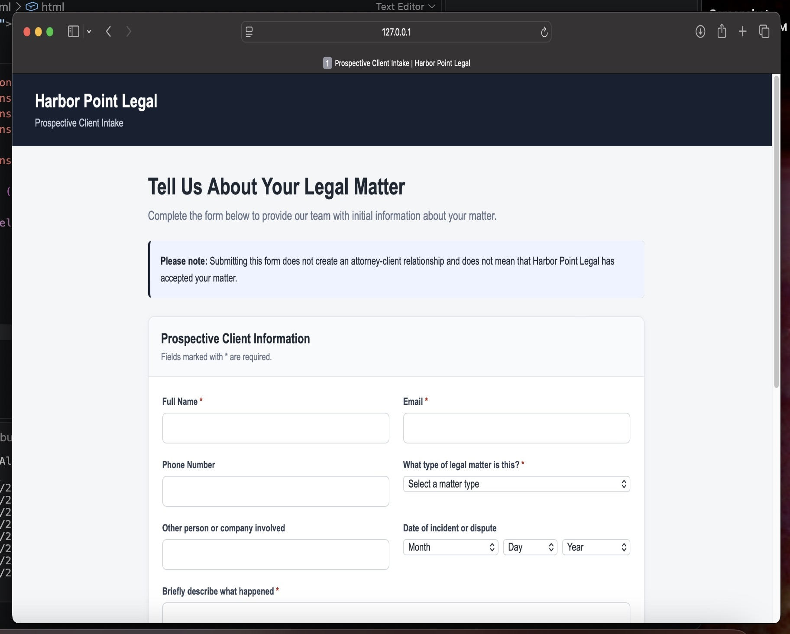
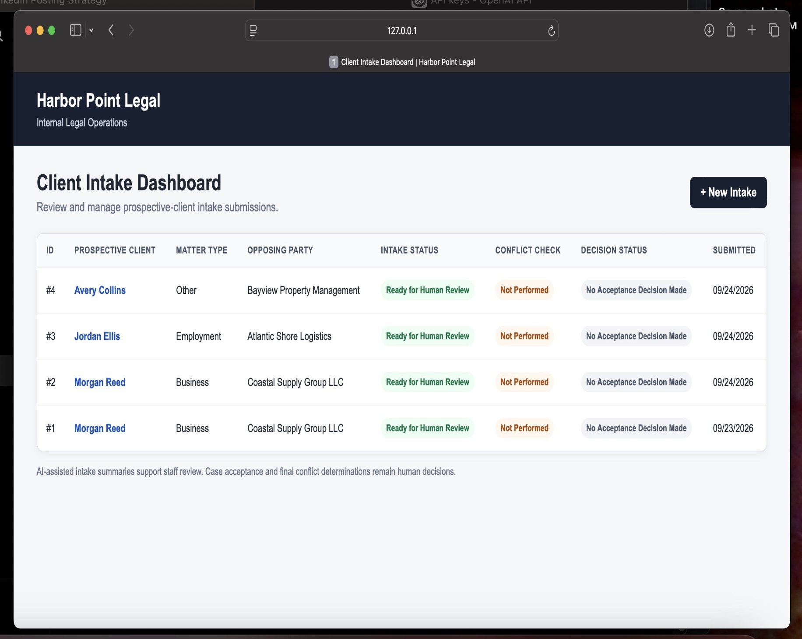
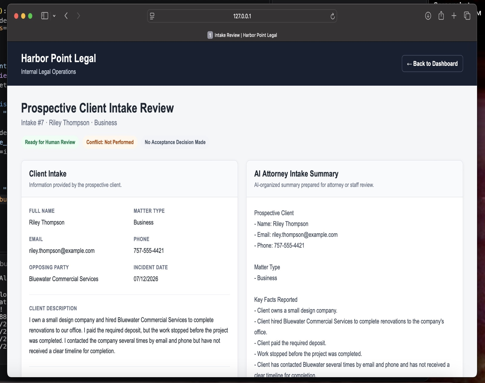
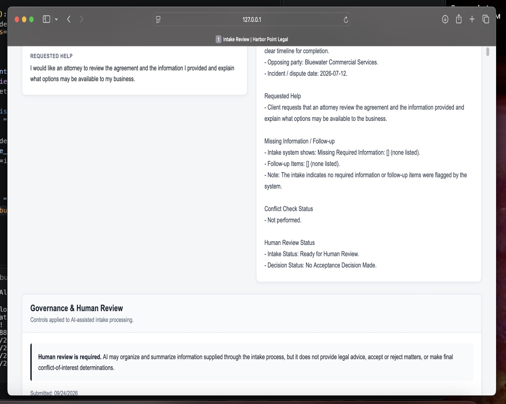

# Legal Client Intake & Matter Operations Automation

A governed AI-assisted legal intake workflow built by **HerCode LLC** to demonstrate how law firms can streamline prospective client intake while keeping consequential legal decisions with authorized human staff.

> **Portfolio Demo:** This project uses entirely fictional firm, client, and matter information. It is not intended to provide legal advice or make legal decisions.

## The Problem

Legal intake often involves repetitive manual work:

- Collecting prospective client information
- Identifying missing or incomplete details
- Preparing information for attorney review
- Organizing conflict check information
- Tracking new matters through the intake process
- Maintaining visibility into matters awaiting review

These manual handoffs can slow response times and make it harder for staff to see what requires attention.

## The Solution

This application creates a structured intake workflow:

**Prospective Client Intake → Validation → AI Summary → Database → Staff Dashboard → Human Review**

A prospective client submits an intake form. Python validates the submission and identifies missing information or follow up needs. A governed AI layer converts the submitted facts into a structured Attorney Intake Summary.

The original intake, validation results, workflow statuses, and AI-generated summary are stored in SQLite and presented through a staff facing dashboard and review interface.

AI assists with information processing it does **not** make the firm's legal decisions.

## Core Features

- Structured prospective client intake form
- Python-based validation and workflow rules
- Missing-information and follow up detection
- AI-generated Attorney Intake Summary
- SQLite intake persistence
- Staff intake management dashboard
- Individual matter review interface
- Human review status tracking
- Conflict check preparation without automated conflict decisions
- Explicit AI governance controls
- Data minimization and local secret management

## AI Governance

Governance is intentionally built into the application architecture rather than added as a disclaimer.

The AI layer may:

- Summarize information supplied by a prospective client
- Organize facts into a structured attorney intake summary
- Surface missing information already identified by system validation
- Prepare information for human review

The AI layer may **not**:

- Provide legal advice
- Accept or reject a prospective matter
- Make a final conflict-of-interest determination
- Predict case outcomes, damages, or settlement value
- Invent facts that were not supplied through the intake

Consequential decisions remain with authorized attorneys or staff.

The application explicitly maintains statuses such as:

- **Ready for Human Review**
- **Conflict: Not Performed**
- **No Acceptance Decision Made**

## Technology Stack

- **Python** — application logic and validation
- **Flask** — backend API and web application
- **OpenAI API** — governed intake summarization
- **SQLite** — intake and workflow persistence
- **HTML/CSS/Jinja** — intake, dashboard, and review interfaces
- **python-dotenv** — environment variable management
- **Git/GitHub** — version control and technical portfolio

## Architecture

```text
Prospective Client
        │
        ▼
 Intake Form
        │
        ▼
 Flask Application
        │
        ├────► Python Validation & Workflow Rules
        │
        ▼
 Governed AI Processing
        │
        ▼
 Attorney Intake Summary
        │
        ▼
 SQLite Database
        │
        ▼
 Staff Dashboard
        │
        ▼
 Human Attorney / Staff Review
        │
        ├────► Conflict Check
        └────► Acceptance / Follow-Up Decision
```

This separation is intentional: AI handles bounded information processing work while Python enforces deterministic workflow logic and humans retain authority over consequential decisions.
## Application Screenshots

### Prospective Client Intake

The client-facing intake form collects structured matter information and clearly states that submitting the form does not create an attorney-client relationship.



### Staff Intake Dashboard

The internal dashboard gives staff a centralized view of prospective matters, intake status, conflict-check status, and decision status.



### AI-Assisted Intake Review

Submitted information is displayed alongside a structured AI-generated Attorney Intake Summary to prepare the matter for human review.



### Governance & Human Review

The workflow explicitly separates AI assistance from consequential legal decisions. Conflict checks and matter acceptance remain human responsibilities.



## Project Structure

```text
hercode-legal-intake-automation/
│
├── app.py
├── ai_summary.py
├── database.py
├── governance.py
├── intake_logic.py
├── requirements.txt
├── .gitignore
│
├── templates/
│   ├── intake.html
│   ├── dashboard.html
│   └── intake_review.html
│
└── data/
    └── legal_intake.db
```

The local database and environment files are excluded from version control.

## Security & Data Handling

The repository is configured to exclude:

- API keys and `.env` files
- Local SQLite databases
- Python virtual environments
- Python cache files
- Local operating system metadata

No real prospective client information is included in this repository.

## Running the Project Locally

### 1. Clone the repository

```bash
git clone <repository-url>
cd hercode-legal-intake-automation
```

### 2. Create a virtual environment

```bash
python3 -m venv .venv
source .venv/bin/activate
```

### 3. Install dependencies

```bash
pip install -r requirements.txt
```

### 4. Configure environment variables

Create a `.env` file in the project root:

```text
OPENAI_API_KEY=your_api_key_here
```

Never commit the `.env` file.

### 5. Start the application

```bash
python app.py
```

Then open:

```text
http://127.0.0.1:5000/
```

The staff dashboard is available at:

```text
http://127.0.0.1:5000/dashboard
```

## Portfolio Context

This project demonstrates HerCode's approach to workflow automation: identify repetitive operational work, automate appropriate processing and handoffs, integrate AI where it provides meaningful value, and preserve human oversight where judgment or consequential decisions are required.

The same architecture can be adapted to professional service workflows involving intake, document processing, routing, review queues, follow up, escalation, and management visibility.

## About HerCode LLC

**HerCode LLC** builds workflow automation, systems integrations, and custom technology solutions that reduce manual work and improve business operations.

This repository is a portfolio demonstration and uses fictional data throughout.

## License & Commercial Use

Copyright © 2026 HerCode LLC. All Rights Reserved.

This repository is publicly viewable for portfolio, demonstration, evaluation, and educational review purposes. It is **not open-source software**.

Commercial use, copying, modification, redistribution, incorporation into commercial products or services, or use in paid client work is not permitted without prior written authorization from HerCode LLC.

Commercial licensing, implementation, customization, and integration may be available through HerCode LLC.

See the [LICENSE](LICENSE) file for complete terms.